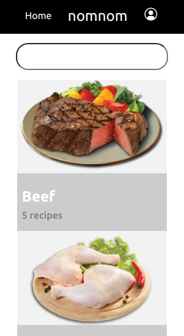
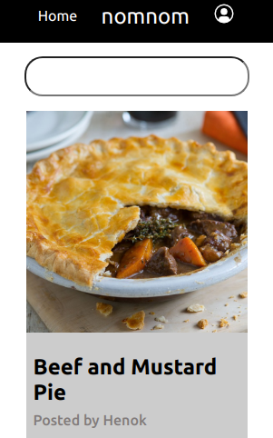
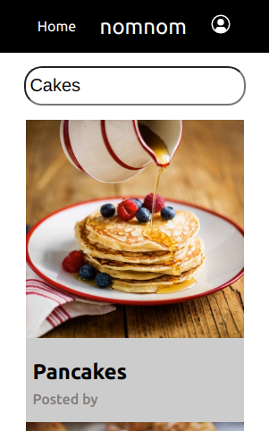

# Cataloge of Recipes 

This project builds the a catalogue of recipes using create-react-app. It dispalys a browsable list of items that can be filtered and accessed to the details of one item. 
The webapp has 3 types of pages:
- one page with a list of items that could be filtered by category.
- one page for the item details; the meal detail page for meals of same category
- one page for the item details; the meal detail page for meals of common search key

## Home or Categories Page

## Meals of Same Catagory Page

## Meals of  Common Search Key

## Live demo [Heroku]
[Book Store App](https://hen-book-store.herokuapp.com/)

## Built With

- `Node.js` | `React` | `React-DOM` | `React-Create-App` | `Hooks` | `Routes` 
- `Redux` | `MiidleWares` | `Backend API` | `npm` | `CSS` | `ES6` 

# Getting Started
This project was bootstrapped with [Create React App](https://github.com/facebook/create-react-app).

## SetUp 
- Clone the repository 
`git clone git@github.com:henatan99/catalogue-of-recipes.git`

- cd to the project directory 
`cd catalogue-of-recipes`

- Install dependancies 
`npm install`

- And follow the App Usage instructions in the next section

## Available Scripts

In the project directory, you can run:

### `yarn start`

Runs the app in the development mode.\
Open [http://localhost:3000](http://localhost:3000) to view it in the browser.

The page will reload if you make edits.\
You will also see any lint errors in the console.

### `yarn test`

Launches the test runner in the interactive watch mode.\
See the section about [running tests](https://facebook.github.io/create-react-app/docs/running-tests) for more information.

### `yarn build`

Builds the app for production to the `build` folder.\
It correctly bundles React in production mode and optimizes the build for the best performance.

The build is minified and the filenames include the hashes.\
Your app is ready to be deployed!

See the section about [deployment](https://facebook.github.io/create-react-app/docs/deployment) for more information.

### `yarn eject`

**Note: this is a one-way operation. Once you `eject`, you can’t go back!**

If you aren’t satisfied with the build tool and configuration choices, you can `eject` at any time. This command will remove the single build dependency from your project.

Instead, it will copy all the configuration files and the transitive dependencies (webpack, Babel, ESLint, etc) right into your project so you have full control over them. All of the commands except `eject` will still work, but they will point to the copied scripts so you can tweak them. At this point you’re on your own.

You don’t have to ever use `eject`. The curated feature set is suitable for small and middle deployments, and you shouldn’t feel obligated to use this feature. However we understand that this tool wouldn’t be useful if you couldn’t customize it when you are ready for it.

## Learn More

You can learn more in the [Create React App documentation](https://facebook.github.io/create-react-app/docs/getting-started).

To learn React, check out the [React documentation](https://reactjs.org/).

### Code Splitting

This section has moved here: [https://facebook.github.io/create-react-app/docs/code-splitting](https://facebook.github.io/create-react-app/docs/code-splitting)

### Analyzing the Bundle Size

This section has moved here: [https://facebook.github.io/create-react-app/docs/analyzing-the-bundle-size](https://facebook.github.io/create-react-app/docs/analyzing-the-bundle-size)

### Making a Progressive Web App

This section has moved here: [https://facebook.github.io/create-react-app/docs/making-a-progressive-web-app](https://facebook.github.io/create-react-app/docs/making-a-progressive-web-app)

### Advanced Configuration

This section has moved here: [https://facebook.github.io/create-react-app/docs/advanced-configuration](https://facebook.github.io/create-react-app/docs/advanced-configuration)

### Deployment

This section has moved here: [https://facebook.github.io/create-react-app/docs/deployment](https://facebook.github.io/create-react-app/docs/deployment)

### `yarn build` fails to minify

This section has moved here: [https://facebook.github.io/create-react-app/docs/troubleshooting#npm-run-build-fails-to-minify](https://facebook.github.io/create-react-app/docs/troubleshooting#npm-run-build-fails-to-minify)

### Prerequisites

- Node.JS

## Authors

👤 **Henok Mossissa**

- GitHub: [@henatan99](https://github.com/henatan99)
- Twitter: [@henatan99](https://twitter.com/henatan99)
- LinkedIn: [Henok Mossissa](https://www.linkedin.com/in/henok-mekonnen-2a251613/)

## :handshake: Contributing

Contributions, issues, and feature requests are welcome!

## Show your support

Give a :star:️ if you like this project!

## Acknowledgment 

- Facebook team who created creat-react-app API 
- [Zeplin project](https://app.zeplin.io/projects)

## :memo: License

This project is [MIT](./LICENSE) licensed.