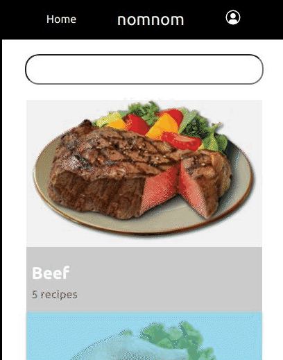

# Cataloge of Recipes 

This project builds the a catalogue of recipes using create-react-app. It dispalys a browsable list of items that can be filtered and accessed to the details of one item. 
The webapp has 3 types of pages:
- one page with a list of items that could be filtered by category.
- one page for the item details; the meal detail page for meals of same category
- one page for the item details; the meal detail page for meals of common search key

## Home or Categories Page

## Meals of Same Catagory Page

## Meals of  Common Search Key

## Built With

- `Node.js` | `React` | `React-DOM` | `React-Create-App` | `Hooks` | `Routes` 
- `Redux` | `MiidleWares` | `Backend API` | `npm` | `CSS` | `ES6` 

## Live demo [Heroku]
[Catalogue of Recipes](https://hen-recipes.herokuapp.com/)

## Getting Started
This project was bootstrapped with [Create React App](https://github.com/facebook/create-react-app).
To get a local copy up and running, please follow the below steps. 

### Prerequisites

- Node.JS
- React

### SetUp 
- Clone the repository 
`git clone git@github.com:henatan99/catalogue-of-recipes.git`

- cd to the project directory 
`cd catalogue-of-recipes`

- Install dependancies 
`npm install`

- And follow the App Usage instructions in the next section

### `npm start`

Runs the app in the development mode.\
Open [http://localhost:3000](http://localhost:3000) to view it in the browser.

The page will reload if you make edits.\
You will also see any lint errors in the console.

### `npm test`

Launches the test runner in the interactive watch mode.\
See the section about [running tests](https://facebook.github.io/create-react-app/docs/running-tests) for more information.

### `yarn build`

Builds the app for production to the `build` folder.\
It correctly bundles React in production mode and optimizes the build for the best performance.

### Usage
The website has three main pages.
- To see recipes category go to home.
- To see navigate to recipes of same category click category card in the home page. 
- To search recipes write keyword on the serach input field. 

## Authors

👤 **Henok Mossissa**

- GitHub: [@henatan99](https://github.com/henatan99)
- Twitter: [@henatan99](https://twitter.com/henatan99)
- LinkedIn: [Henok Mossissa](https://www.linkedin.com/in/henok-mekonnen-2a251613/)

## :handshake: Contributing

Contributions, issues, and feature requests are welcome!

## Show your support

Give a :star:️ if you like this project!

## Acknowledgment 

- Facebook team who created creat-react-app API 
- [themealdb API service](www.themealdb.com/api)
- [Behance](www.behance.net) for cool design references 

## :memo: License

This project is [MIT](./LICENSE) licensed.